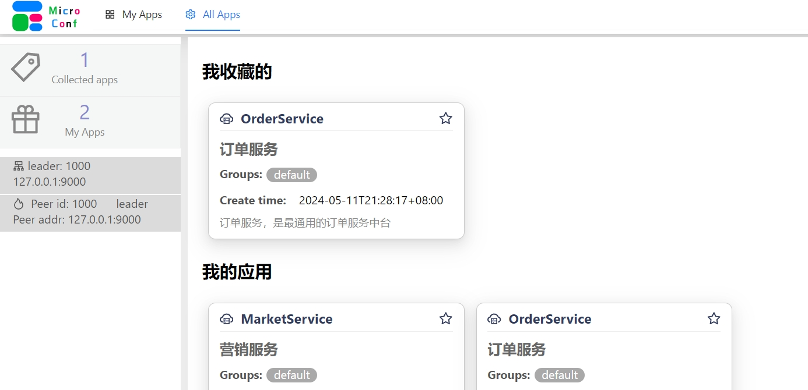
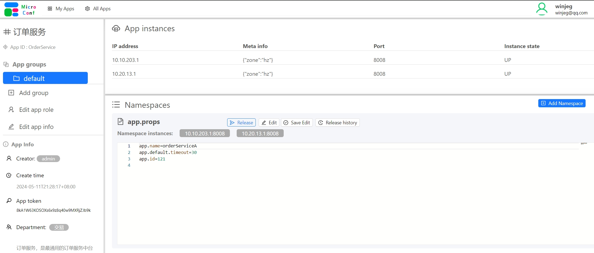

# micro-conf


去中心化的配置平台和注册中心
> 底层使用 raft协议，API与存储统一服务， 部署和维护极为简单
> 前端页面也统一维护
> 一键启动
> 可以前置nginx进行转发
> 高可用，任意一台服务不可用，不影响其他节点正常提供业务
> 客户端自动重连
> 采用Websocket连接方式进行心跳上报和配置推送

## 使用

1. 需要首先在平台上建立一个App， 并且获取到这个App对应的KEY才可以使用此平台，没有例外
2. 创建APP只有平台Admin才有权限， 不是任何人都能创建APP的，只能通过界面创建
3. 创建完成APP后即可使用这个API KEY注册 微服务， 微服务的注册是不可手动进行的，只能由应用主动注册
4. 如果想给应用增加其他配置，那么需要在界面上另外添加配置的选项
5. 管理员可以创建普通用户，也可以给普通用户某个App Owner 权限或者 Dev权限， 有了权限， 就可以去对这个App的一些配置进行修改和发布


## user admin 管理后台界面

微配置 管理后台


微配置应用详情页面



## how to deploy.  如何部署


## clients 客户端

目前计划支持Java 和Golang的客户端，其他语言的客户端暂时不支持
如果开发者有兴趣， 欢迎编写其他语言的客户端，并提交. 可以联系我，直接建立对应的仓库。

## 附录：各模块 API 列表

- [app设计及接口](./docs/app.md)
- [服务注册&治理相关接口](./docs/svc.md)
- [配置中心相关接口](./docs/cfg.md)
- [raft集群及存储底层接口](./docs/raft.md)


## 存储 KeyPattern

```
# 用户相关信息
user.info.{username}   // 用户的基础信息
user.admin.{username} // 管理员信息

# 配置信息相关
cfg.app.     // 配置信息

# 注册中心相关
svc.meta.{appId}.{groupId}.{IP}:{port}      // 注册服务的元信息
svc.state.{appId}.{groupId}.{IP}:{port}   // 注册的服务的状态

# app 的信息
app.info.{appId}    // app的基础信息， 包括API KEY, 创建人， 创建时间， 部门， 权限列表等
```